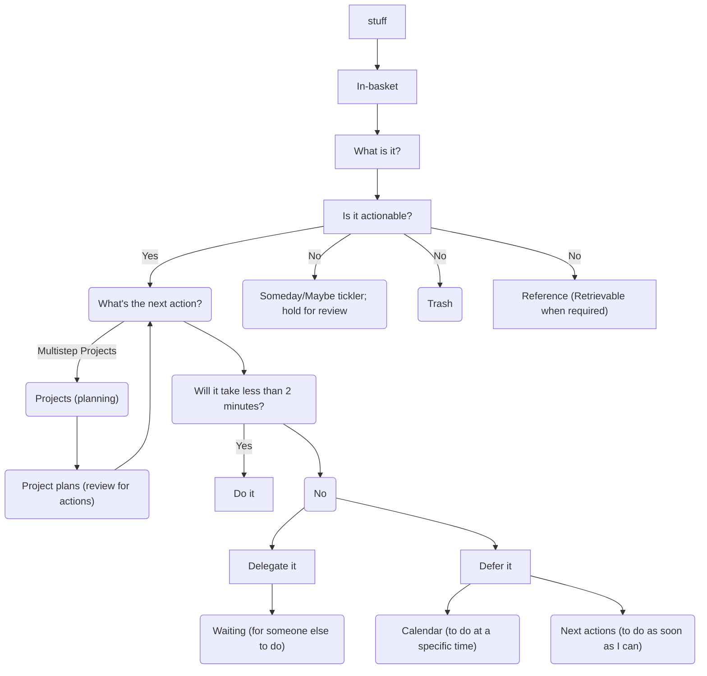

---
{"dg-publish":true,"permalink":"/reading-and-writing/books/getting-things-done/","tags":["books","productivity"],"noteIcon":3}
---

I spend the first third of this book nodding along and finding the ideas presented extremely basic. By the halfway point, I had started to jot some things done. There were only a few ideas I truly found novel, and fewer yet that made me bolt upright and rethink my existing approaches. What follows are my main takeaways. Almost everything here is quoting from the book directly, with little commentary.

In general, a good todo list system needs to be better than a sheet of paper. The advantage of a sheet of paper is also its greatest weakness: it forces you to only focus on the 30 or so most immediate things, and anything behind that gets lost.

---

* Always have to have next action, desired outcome
	* Probably need to break things down further than you think. What is the **next action** you need to take to process this?

* Keep a physical inbox, with each action item on its own sheet of paper
	* Keep it dry. It should **never** be a resting place. Empty it immediately, process into a stable place.

"As to methods, there may be a million and then some, but principles are few. The man who grasps principles can successfully select his own methods. The man who tries methods, ignoring principles, is sure to have trouble." — Ralph Waldo Emerson

Getting things done requires two basic components: defining (1) what "done" means (outcome) and (2) what "doing" looks like (action). And these are far from self-evident for most people about most things that have their attention.

We (1) *capture* what has our attention; (2) *clarify* what each item means and what to do about it; (3) *organize* the results, which presents the options we (4) *reflect* on, which we then choose to (5) *engage* with.

"It is better to be wrong than to be vague." — Freeman Dyson

### Purpose
==It never hurts to ask the *why* question. Almost anything you're currently doing can be enhanced and even galvanized by more scrutiny at this top level of focus. Why are you going to your next meeting? ==What's the purpose of your task? Why are you having friends over for dinner? Why are you hiring a marketing director instead of an agency? Why are you putting up with the situation in your service organization? Why do you have a budget? Ad infinitum.

Once you know your purpose, this makes it easy to answer questions. Should I check email on vacation? Well, why are you taking a vacation? Answer may become obvious!

---
### Clarity
What will this project look like when it's done? How do you want the client to feel, and what do you want him to know and do after the presentation? Where will you be in your career three years form now? how would the ideal head of finance do his job? What would your web site really look like and have as capabilities if it could be the way you wanted? What would your relationship with your son feel like if this conversation you need to have with him were successful?

"Wouldn't it be great if..." is not a bad way to start thinking about a situation, at least for long enough to have the option of getting an answer.

"David," he said, "You're going to college, and you're going to be writing papers. Write all your notes and quotes on separate three-by-five-inch cards. Then, when you get ready to organize your thinking, just spread them all out on the floor, see the natural structure that emerges, and figure out what's missing."

In my experience (*this is a quote from the book, not Alex talking*), creating a list of what your real projects are and consistently managing your next action for each one will constitute 90 percent of what is generally thought of as project planning. This ground-floor approach will make you honest about all kinds of things. Are you really serious about doing this? Who's responsible? Have you thought things through enough?

---
### On building your master list

It will probably take you between twenty minutes and an hour to clear your head onto separate notes, *after* you've gathered everything else. You'll find that things will tend to occur to you in somewhat random fashion — little things, big things, personal things, professional things, in no particular order.

In this instance, go for quantity. It's much better to overdo this process than to risk missing something. You can always toss the junk later. Your first idea may be "Implement global climate change", and then you'll think, "I need cat food!" Grab them all. Don't be surprised if you discover you've created quite a stack of paper in "in" during this procedure.

### Triggers list
To assist in clearing your head, you may want to review the following Incompletion Triggers list, item by item, to see if you've forgotten anything. Often you'll just need a job to unearth something lurking in the back of your mind. Remember, when something occurs to you, write it on a piece of paper and toss it onto "in".

Incompletion Triggers (page 116, second edition)
Professional: 
Projects started, not completed
Phone calls
(it goes on for some time, not reproducing here).

When you're in processing mode, you must get into the habit of starting at one end and just cranking through items one at a time, in order. As soon as you break that rule and process only what you feel like processing, in whatever order, you'll invariably begin to leave things unprocessed. Then you will no longer have a functioning funnel, and it will back up all over your desk and office and e-mail “in” repositories.

If you neglect this categorization, and allow things of different meanings into the same visual or mental groupings, you will tend to go psychologically numb to the contents. If you put reference material in the same pile as things you still want to read, for example, you'll go unconscious to the stack. If you put items on your Next Actions list that really need to go on the calendar, because they have to occur on specific days, then you won't trust your calendar and you'll continually have to reassess your action lists. If you have projects that you're not going to be doing anything about for some time, they must go on your Someday/Maybe list so you can relate to the Projects list with the rigorous action-generating focus it needs. And if something you're Waiting For is included on one of your action lists, nonproductive rethinking will continually bog you down.

==I have a personal mission to make "What's the next action?" part of our global thought process.== I envision a world in which no meeting or discussion will end, and no interaction cease, without a clear indication of whether or not some action is needed — and if it is, what it will be, or at least who has accountability for it. I envision organization adopting a standard that anything that lands in anyone's field of awareness will be evaluated for action required, and the resulting decisions managed appropriately. 

## Critique
Projects with multiple steps aren't captured, even if more than one can be done right now. No talk of capturing sub tasks or dependencies.

Since reading this book, I've taken some of this to heart, and have been rekindling my search for digital task managers that work for me. After a few months of using Remember The Milk (which I liked VERY much, aside from the same complaints about GTD listed above, I have currently settled on The Amazing Marvin. It isn't perfect, and I'm not sure that I like it better than RTM, but it's extremely configurable, and the customer support is sublime).

One of the areas I found the most friction with GTD as its presented is the notion that you must capture all ideas equally. Technically, Allen does not mandate equality: he suggests putting some in filing cabinets or one day "tickler" files. But I prefer more strata. There is a short term list that warrants weekly review, a long term "projects" list, and other things that are less urgent, but would benefit from a monthly review (or similar cadence). I suspect Allen would encourage me to put these in a filing cabinet reviewed at the start of the month, and maybe I would indeed benefit from such a process.